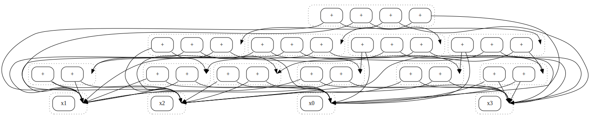
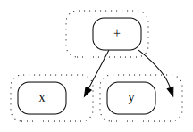

# Omelets need Onions

### E-graphs Modulo Theories via Bottom Up E-Matching

Philip Zucker (Draper Labs)

<!--

Nice picture of eggy omelet?

---

# Overview

- Bottom-up E-matching
  - Terms Modulo Theories
  - Patterns
- Semantic E-ids
  - E-graphs are models
  - UF is canonizer for atomic equations
  - Linear expressions, polynomials, multisets also have canonizers
  - Undecidable canonizers

-->

---

# Motivation: AC Sucks

- The Eqsat Paradox
- $(x_1 + (x_2 + ...(x_{N-1} + x_N)...))$
- #e-classes: $2^N-1$
- #e-nodes: $3^N - 2^{N+1} + 1$  



<!--

Associativity and commutativity are a part of many problems
Basic algebra with 
plus
times
lattices
abelian groups

-->

---

# E-Graphs Modulo Theories

- EMT ~ SMT - SAT
- Can we bake in domain specific smarts?
<!-- - Not Just AC: Polynomial, linear, sets -->
- E-graph sharing makes confusing 😵‍💫

<!--
Role as simplifier vs prover modes.

-->

<!-- picture? 
- The eqsat paradox
- We want stuff baked in.

|  e-classes | e-nodes |
|------------|-----------|
|  $2^N-1$ | $3^N - 2^{N+1} + 1$ |

import operator
z3.Solver()
xs = [smt.Int("x" + i) for i in range(100)]
z3.prove(reduce(operator.add, xs) == reduce(operator.add, reversed(xs)))

xs + [-x for x in xs]
z3.simplify(reduce(operator.add , xs))

TANSTAAFL ~ There ain't no such thing as a free lunch

---

# EMT = SMT - SAT

- Built in reasoning over
  - Linear arithmetic
  -

---

-->

---

# Tease Apart the Roles

E-graphs are:

- Term banks `add_term : t -> term -> unit`
- Equality stores `assert_eq : t -> term -> term -> unit`

<!--  
- `E.union(t,t)`

- Term finders `match : t -> pat -> subst list`
- Equality checkers `is_eq : t -> term -> term -> bool`
- Canonizers `t -> term -> term`

The first half of the talk is the role as a term bank
the second half is as its role as an equality store

These are allow intertwicned
A good method is to simplify a problem unitl its basically trivial and then add back in the ocmplexity.

Theory -> E-TermBank 
The unionfind tikes the knot back to the theory
Teasing apart these different roles.

-->
<!-- Breadth first -->
<!--
---

# Naive Equational Search

- Hash Cons a term bank
- Rewrite over it
- Mark discovered equalities as edges.
- Egraphs as term banks
  - c

---

# E-graphs and Term Banks

- E-graphs are both term banks and equality stores

- c = c

---
-->

<!-- Term Banks Modulo Theories -->
<!-- Hash consing modulo theories -->
---

# Term Banks Modulo Theories

- Rigid baked in "nice" theories.
- Interning by structural normalization
  - Smart constructors apply convergent rewrites to normal forms

    - Ex: $x + 0 \rightarrow x$

    ```python
    def add(x,y):
      return x if y == 0 else ("+", x, y)
    ```

  - Children collections (set, multiset, polynomials, etc)

      ```python
      def add(*args):
        return ("+", multiset(args))
      ```

<!--
Too condensed.
An example. Show 

add_term(add((x,add(0,0)))
add_term(add(x,0))

-->

<!-- 

- Hash consing mod theories via structural normalization

What was so frut6rating about AC? Flatteining and sorting

-->

<!-- Show rules. x + 0 -> x -->
<!-- show smart constructor

def add(x,y):
  return x if y == 0 else ("+", x, y)
- Hash Consing Modulo Theories
  - Canonize
  - Homomoprhic Hashes

```ocaml
type term = {head : str; children: children}
and children =
  | Ordered of term list
  | MS of term multiset
```

-->
---

# Term Banks Modulo Theories

|   |   |   |
|---|---|---|
| `add_term : t -> term -> unit` |  ✅ | `hashcons` |
| `match : t -> pat -> subst list` | ❓ |   |
| `is_eq : t -> term -> term -> bool` | ✅ | `is` |
| `canon : t -> term -> term` |  ✅  | `id` |
| `assert_eq : t -> term -> term -> unit` | 🤔❌ | |

<!-- 
Assert_eq can be dealt with via a brute force table.
Maybe not an X so much as a so-so

Is the second half of the talk necessary?
You can kind of take terms modulo theories and toss on a union find?
Uhhhh. Maybe (?). No.

Can I add ground rules to a convergent rewrite system and always make it work?
No. String rewriting counterexampel. Really?
Well you can keep normalizing terminating.
But not confluent.

-->

---

# Pattern Matching

- Implicit terms
  - Pattern is `?x + 0` but smart constructor absorbs `0`
- E-matching
  - Top Down
  - Bottom Up

```
add_term((x + 0) + y)
```



<!-- https://en.wikipedia.org/wiki/Bell_number This also what people mean by using AC for addition.
AC1 is multiset matching. Both are really.
Maybe the second is ACI?
B_n

Flatterns
flatterms
 -->
---

# Top Down E-matching

- Scan termbank for term roots
- #substitutions depends on theory
  - Factor $F$ at each theory node of pattern

|  Theory  |  Pattern   |  Theory Factor $F$  |
|-------------|------------|--------|
|    ADT      |    $cons(X,Y) =^? cons(1, nil)$     |   1   |  
|  E-Graph  |   $foo(X,Y) \in^? \{foo(e_1,e_2), bar(e_2) \}$         |   $\|eclass\|$ |
|      MultiSet 1     |  $[X,Y,Z] =^? [1,2,3]$ | (\#Vars)!  |  
|      MultiSet 2     |  $X + Y =^? [1,2,3]$  | #Partitions |
|    Linear   | $X + Y =^? 42$  |  $\infty$  |

<!-- `match : t -> pat -> subst list` -->
---

# Bottom Up E-matching

- E-match _over the term bank_, not on term
  - `match : term -> pat -> subst list`
  - `match : termbank -> pat -> subst list`
- Bind variables by traversing term bank
  - Ex: $foo(bar(X), Y) \rightarrow biz(X)$

```python
for X in terms:
  for Y in terms:
    lhs = foo[bar[X], Y]
    if lhs in terms:
      rhs = biz(Z)
      add_equality(lhs, rhs)
```

<!--
Why is this not intuitive.
We have this single term mindset. 
You can convert pattern matching 

Vectorized versions of stuff

-->
---

# Bottom Up E-matching Plays Nicer with Theories

- Why?
  - Grounds fast
  - Only needs canonizer, not expander
<!-- - Theory Factor $F = \frac{N}{E}$, Pattern depth $d$ -->
- Top down $O(T F^d )$.
  - Deep is bad. Ex: $foo(foo(foo(foo(X))))$
- Bottom up $O(T^V d \ln(T))$
  <!-- - No $F$ dependence -->
  - Many Var is bad. Ex: $foo(X,Y,Z,W,V,U)$
- Pareto frontier for simplicity-power

<!-- 

Completness.

-->

<!--
Give conrete data for
((x + y) + z) pattern?

Shallow many vars

- Benefits of Theories & simplicity vs Flexibility and optimiality?
  - I dunno
- E-Graphs have Term Banks
- Generate terms, prune, discover equalities
-->

<!--

---

## Demo

```python
    def ematch(self, vs: list[smt.ExprRef], pat: smt.ExprRef) -> list[list[smt.ExprRef]]:
        res = []
        for eids in itertools.product(*[self.roots[v.sort()] for v in vs]):
            ts = [self.terms[eid] for eid in eids]
            lhs = smt.substitute(pat, *zip(vs, ts))
            if self.in_terms(lhs):
                res.append(ts)
        return res
```

---

### Brute Force SMT E-Graph

-->
---

# Tying the Knot

|   |   |
|---|---|
| `add_term : t -> term -> unit` |  ✅ |
| `match : t -> pat -> subst list` | ✅ |
| `is_eq : t -> term -> term -> bool` | ✅|
| `canon : t -> term -> term` |  ✅ |
| `assert_eq : t -> term -> term -> unit` | ❌ |

<!-- 
assert_eq in the e-graph is supplied by the union find?

- So far a fixed background "good" notion of equality
- E-graphs assert pieces pulled from of "bad" notions of equality

-->
---

<!-- 
---
---

# E-Graphs are Models

- Funnels from syntax to semantics

## Union finds

- Canonizers ground atomic equations
- What interface really matters?
- Shostak theories

---

# E-graphs are Models
<!-- What are E-graphs? 

- E-graphs are models of a partial logic
- $\downarrow t$ and  $t_1 = t_2$
- SMT models (show z3)
  - Free Logic
  - Generalized Algebraic Theories
  - Essential Algebraic Theories
  - Partial Horn Logic

-->

# Q: What is this the interface to?

```ocaml
type t
type id
val create : unit −> t
val eq : t −> id −> id −> bool
val fresh : t −> id
val canon : t −> id −> eid
val assert_eq : t −> id −> id −> unit
```

<!-- 
val rebuild 

The union find? Yes. also the egraph itself 

SMT solvers and their theories present the same interface.
If you don't use SAT, SMT is its theory.

Egraphs and union finds also present the same interface.

type key
interpret : t -> key -> eid   union find dict
explain
lookup : t -> eid -> key (extract)

# Union Find Replacements

```ocaml

type t = uf
type eid = int

type t = egraph 
type id = eid

type t = uf_unify
type term_id = Eid of int | Constr of str * term_id list | PrimInt int

type t = row_echelon
type eid = int lin_expr

type t = grobner
type eid = int poly

type t = rewrite_rules
type eid = Var of int | Eid of int | Fn of string * eid list 
```

-->

---

# Semantic E-ids
<!--
The internals of the union find don't matter. 
-->

<!-- e-ids as values -->
- Replace union find with theory specific extensible canonizers
  - Rebuild has the flavor of _ground_ Knuth Bendix completion
- Alternative names: Structured e-ids, Values
<!--
- E-graphs are Models
  - $\downarrow t$ and  $t_1 = t_2$
-->
- Merges the concepts of containers, primitives, and e-ids

---

# Decidable & Cheap

| eids |  example                       |    Rebuild        |    Data Structure |
|------------------|--------------------|------------------|---------------------|
| Atomic / Uninterp |  $e_1$             |  Compress      | Union Find
| primitive + uninterp |   $Cons(7, e_1)$   |  Compress/Unify  | Value rooted UF + Unification
| Group(oid) Action   |   $e_1 + 7$     |      Compress   | Group UF
| Lin Expr         |    $2e_1 - 4e_7$     |   Gauss Elim   | Row Echelon
| Ground Terms    |      $foo(bar(e_7))$        |  E-graph Rebuild       | Inner E-Graph   |

<!--  Lighter to heavier weight 

Destructive rewrites over disjoint signature

Cheap Decidable  (P)
Expensive Decidable (Super polynomial)
Undecidable 
-->

---

# Decidable & Expensive

| eids |  example |    Rebuild Algo       |    Data Structure
|------------------|--------------------|------------------|---------------------|
|  Polynomials           |   $e_1 + 6e_4^3$      |   Buchberger   | Grobner Basis  
| Ground Multiset (AC)     |   $[e1, e1, e2]$       |   Knuth Bendix      |   Graver / Hilbert bases / Convergent Rewrite System  |
| SMT Terms       |                      | SMT sweeping  | SMT Solver |
| Bool Exprs       | $e_1 \land e_2 \lor e_3$ | SAT Sweeping  / BDDs / AIGs / Ordered Resolution      |            |

<!-- 

Ground multiset solves AC

-->

---

## Strong (Undecidable) Theories

|  eid | example  |  Rebuild Algo   |   |
|---|---|--|--|
|  Strings        | $e_1 e_4 e_2$ |  String KB  | String Rewrite Rules |    Program seqeuences |
| Terms w/ Vars  | $foo(e_1, X)$    |             KB                           |    Rewrite Rules

---

# More?

| eids |  Example  |    Rebuild        |    Data Structure |
|-----------------|-----------|---|---|
|  Slotted eids?  |   $\lambda_{i j k}e_3(j,k,i)$ ?       |   ?  | ? | ? |
| Colored eids?  |  $\Gamma \vdash e_{17}$ ? | ?  | ?  | ? |
| Non commutative Rings |    $\partial_x e_1$        |      ?      |       ?        | ? |

---

<!--
Note: differentiation, quantum operators
Is there a form of differentiable that would be solvable?
Linear differential (?)
partial_t only? That might make a module for with smith normal form works

- Black Boxes/Automation are decision procedures or linear time or constant time
- undecidable/interactive/tweakables    poly time
-->

---

# Related Work

- Normalized Rewriting
- Extract, Rewrite, and Assert
- Brute Force SMT E-Graph

---

# Thank You

- Pre-print <https://arxiv.org/abs/2504.14340>
- Prototype: <https://www.kdrag.com>  
  - `from kdrag.solvers.egraph import EGraph`

---

# Bits and Bobbles

<https://arxiv.org/abs/2504.14340>

I should really trim and make some astuff things I just say.

The juncture between "things egraph does" and "what is this the signature of" is clunky. They're too similar.

Summary Slides

Pavel quantifier elimination

I don't really have to hit every point of the paper. It's too much.
A sale pitch for the paper kind of.

It would be good to have a running example.

Brute SMT?

Is this too much stuff for 20mins? What really are my priorities?

Look at reviewer suggestions.

Show shallow top down e-match
Show shallow bottom up e-matcher

There's a chance I could cut the second half of the talk about semantic e-ids.

```ocaml
type uf
type eid
val create : unit −> t
val eq : uf −> eid −> eid −> bool
val fresh : uf −> eid
val canon : uf −> eid −> eid
val assert_eq : uf −> eid −> eid −> unit
val rebuild : 
```

```ocaml
type uf
type eid = int

type t = uf+
type eid = 

type t = egraph 
type id = eid

type t = matrix
type eid = lin_expr

type t = poly_sys
type eid = poly

type t = rewrite_rules
type eid = term
```

```python
class ????():
  eid : type
  def is_eq(self, x : eid, y : eid) -> bool:


```

# EqSAT is incomplete

- All eqsat methods are incomplete
- More research on smart, simple efficient, fruitful term enumeration.
- x*0 = 0
- inv(x) * x = 1
